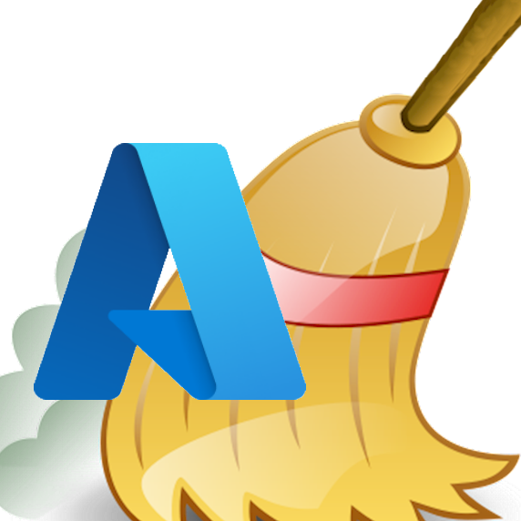
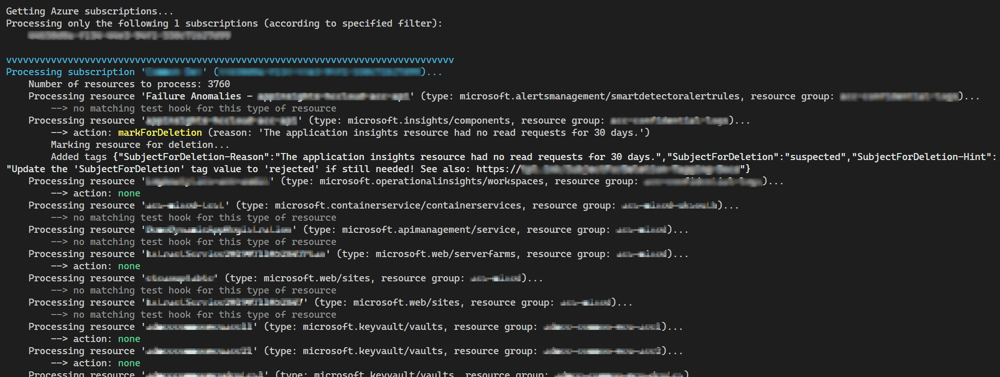
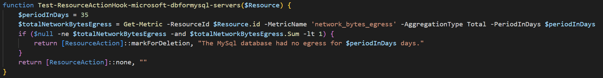

<!-- SHIELDS -->
<div align="center">

[![Contributors][contributors-shield]][contributors-url]
[![Forks][forks-shield]][forks-url]
[![Stargazers][stars-shield]][stars-url]
[![Issues][issues-shield]][issues-url]
[![MIT License][license-shield]][license-url]

</div>

<!-- PROJECT LOGO -->
<br />
<div align="center">
  <a href="https://github.com/thgossler/AzSaveMoney">
    
  </a>
  <h1 align="center">AzSaveMoney</h1>
  <p align="center">
    Clean-up unused resources and save money and energy in your Azure environment.
    <br />
    <a href="https://github.com/thgossler/AzSaveMoney/issues">Report Bug</a>
    ·
    <a href="https://github.com/thgossler/AzSaveMoney/issues">Request Feature</a>
    ·
    <a href="https://github.com/thgossler/AzSaveMoney#contributing">Contribute</a>
    ·
    <a href="https://github.com/sponsors/thgossler">Sponsor project</a>
    ·
    <a href="https://www.paypal.com/donate/?hosted_button_id=JVG7PFJ8DMW7J">Sponsor via PayPal</a>
  </p>
</div>

## Overview

This project is intended to clean up large Azure environments and save money and energy in the process. It was inspired by the project [`itoleck/AzureSaveMoney`](https://github.com/itoleck/AzureSaveMoney) but is not derived from it.

The script [`MarkAndDeleteUnusedResources.ps1`](MarkAndDeleteUnusedResources.ps1) checks all Azure resources and resource groups across all subscriptions and eventually tags them as subject for deletion or deletes them automatically (after confirmation, configurable). Based on the value of the tag, suspicious resources can be confirmed or rejected as subject for deletion and will be considered accordingly in subsequent runs.

> **Note**: The script supports the -WhatIf parameter to first simulate what it would do. And it was also implemented to be defensive, i.e. by default only empty resource groups are deleted (and only after confirmation), nothing else.

Example usage:

```powershell
# Display usage help
Get-Help .\MarkAndDeleteUnusedResources.ps1 -Detailed
```

```powershell
# Simulate execution on all subscriptions in the default directory of the AzureCloud environment
. .\MarkAndDeleteUnusedResources.ps1 -WhatIf
```

```powershell
# Execute on all subscriptions in the default directory of the AzureCloud environment.
# The parameter UseDeviceAuthentication allows indirect user sign-in with device code, e.g.
# in a devcontainer where the web browser cannot used.
. .\MarkAndDeleteUnusedResources.ps1 -UseDeviceAuthentication
```

```powershell
# Execute on all subscriptions in the default directory of the AzureCloud environment.
# The parameter ServicePrincipalCredential allows sign-in with a service principal.
$appId = 'f246e0a1-5996-4a2f-971d-c6d4da41510e'
$secret = (ConvertTo-SecureString -String '...' -AsPlainText)  # secret must not be in source code, just for illustration!
$cred = (New-Object System.Management.Automation.PSCredential $appId, $secret)
. .\MarkAndDeleteUnusedResources.ps1 -ServicePrincipalCredential $cred
```

```powershell
# Execute on one subscription in the specified directory of the AzureChinaCloud environment
. .\MarkAndDeleteUnusedResources.ps1 `
      -DirectoryId 'e0fe770b-8e36-4af1-9b67-4cda0ebe97e0' `
      -AzEnvironment 'AzureChinaCloud' `
      -SubscriptionIdsToProcess @("e6229d85-f212-44a3-b9f2-c0bd3394c833") `
      -TryMakingUserContributorTemporarily `
      -DisableTimeoutForDeleteConfirmationPrompt
```

Example output:


Example tags:


The script was intentionally written in a single file to ensure ease of use across various environments. The log output is written to the host using colors to improve human readability.

The default values for some parameters can be specified in a config file named `Defaults.json`.

The script implements function hooks named for each supported resource type/kind. Function hooks determine for a specific resource which action shall be taken. The naming convention for hooks is `Test-ResourceActionHook-<resourceType>[-<resourceKind>]`. New hooks can easily be added by implementing a new function and will be discovered and called automatically. New hooks should be inserted after the marker `[ADD NEW HOOKS HERE]`.

Example hook function:


There are multiple tags which are set when a resource is marked as  subject for deletion (tag names are configurable):
`SubjectForDeletion`,
`SubjectForDeletion-FindingDate`,
`SubjectForDeletion-Reason` and
`SubjectForDeletion-Hint` (optional).

The `SubjectForDeletion` tag has one of the following values after the script ran and the tag was created:

- `suspected`: resource marked as subject for deletion
- `suspectedSubResources`: at least one sub resource is subject for deletion

As long as the tag `SubjectForDeletion` has a value starting with `suspected...` the resource is reevaluated in every run and the tag value is updated (overwritten). You can update the tag value to one of the following values in order to influence the script behavior in subsequent runs (see below).

Here is a sample Azure Resource Graph query that identifies all resources suspected to be unused:

```kusto
resources 
| where tags['SubjectForDeletion'] != '' and tags['SubjectForDeletion'] startswith 'suspected'
| project name, type, subjectForDeletionReason=tags['SubjectForDeletion-Reason'], resourceGroup, subscriptionId, id
| sort by name asc 
```

The following process is recommended for large organizations:

1. **RUN** the script regularly
2. **ALERT** `suspected` or `suspectedSubResources` resources to resource owners
3. **MANUAL RESOLUTION** by owners by reviewing and changing the `SubjectForDeletion` tag value to one of the following predefined terms (case-sensitive!):
   - `rejected`: Resource is needed and shall NOT be deleted (this status will not be overwritten in subsequent runs, except if configured to be reset e.g. every 6 months after `SubjectForDeletion-FindingDate`)
   - `confirmed`: Resource shall be deleted (will be automatically deleted in the next run)
4. **AUTO-DELETION/REEVALUATION**: Subsequent script runs will check all resources again with the following special handling for status:
   - `confirmed`: resource will be deleted
   - `suspected`: if `SubjectForDeletion-FindingDate` is older that 30 days (e.g. resource was not reviewed in time), the resource will be automatically deleted

The script [`RemoveTagsFromAllResourcesAndGroups.ps1`](RemoveTagsFromAllResourcesAndGroups.ps1) can be used to remove all tags again.

## Contributing

Contributions are what make the open source community such an amazing place to learn, inspire, and create. Any contributions you make are **greatly appreciated**.

If you have a suggestion that would make this better, please fork the repo and create a pull request. You can also simply open an issue with the tag "enhancement".
Don't forget to give the project a star :wink: Thanks!

1. Fork the Project
2. Create your Feature Branch (`git checkout -b feature/AmazingFeature`)
3. Commit your Changes (`git commit -m 'Add some AmazingFeature'`)
4. Push to the Branch (`git push origin feature/AmazingFeature`)
5. Open a Pull Request

## Donate

If you are using the tool but are unable to contribute technically, please consider promoting it and donating an amount that reflects its value to you. You can do so either via PayPal

[](https://www.paypal.com/donate/?hosted_button_id=JVG7PFJ8DMW7J)

or via [GitHub Sponsors](https://github.com/sponsors/thgossler).

## License

Distributed under the MIT License. See [`LICENSE`](https://github.com/thgossler/AzSaveMoney/blob/main/LICENSE) for more information.

<!-- MARKDOWN LINKS & IMAGES (https://www.markdownguide.org/basic-syntax/#reference-style-links) -->
[contributors-shield]: https://img.shields.io/github/contributors/thgossler/AzSaveMoney.svg
[contributors-url]: https://github.com/thgossler/AzSaveMoney/graphs/contributors
[forks-shield]: https://img.shields.io/github/forks/thgossler/AzSaveMoney.svg
[forks-url]: https://github.com/thgossler/AzSaveMoney/network/members
[stars-shield]: https://img.shields.io/github/stars/thgossler/AzSaveMoney.svg
[stars-url]: https://github.com/thgossler/AzSaveMoney/stargazers
[issues-shield]: https://img.shields.io/github/issues/thgossler/AzSaveMoney.svg
[issues-url]: https://github.com/thgossler/AzSaveMoney/issues
[license-shield]: https://img.shields.io/github/license/thgossler/AzSaveMoney.svg
[license-url]: https://github.com/thgossler/AzSaveMoney/blob/main/LICENSE
